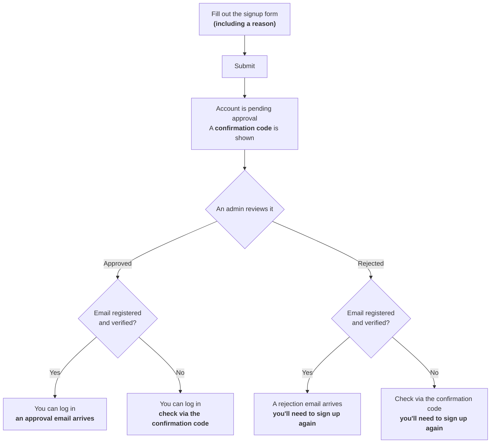

# Approval-based signup

Juice Server uses "approval-based signup", which requires a reason for registration and reviews it before an admin approves the account. **Submitting the signup form does not make your account usable right away.**

## From signup to being able to log in



### 1. Fill out the signup form

In addition to the usual fields (username, password, email address, etc.), there is a **"reason for registration"** field. Briefly describe what you'd like to use the account for (up to 4096 characters). This reason is not shown to other regular users or applicants — **only admins** can view it.

#### A template for your reason for registration

If you're not sure what to write, feel free to use a template like the one below. You don't need to fill in every line, and it doesn't have to sound formal.

```
Purpose:
(e.g. posting my own creations, chatting with friends, following news, etc.)

What you plan to post:
(e.g. illustrations, everyday posts, talking about games, etc.)

Accounts on other SNS/instances (optional):
(if you have one, an X (Twitter) handle or another instance account helps with review)
```

A single sentence, like "I want to post my illustrations," is also perfectly fine.

### 2. After submitting, your account is "pending approval"

Once you submit the form, the account itself is created, but **you cannot log in until it is approved.** At this point, a **confirmation code** for checking your application status is shown on screen. **Make sure to copy it right away** (see "Checking your status later" below).

### 3. An admin reviews your reason for registration

An admin (a user with moderator or admin permissions) reviews your reason for registration and either approves or rejects it. Review time varies case by case.

### 4. You receive the result

- **If approved**: you can log in. If you registered and verified an email address, you'll also receive an approval notification email; if not, it won't be sent, so check your approval status using the confirmation code on the `/signup-check` page.
- **If rejected**: if you registered and verified an email address, you'll receive a rejection notification email. If not, you can likewise check that you were rejected — and the reason — via the confirmation code on the `/signup-check` page. If you'd like to try again, please sign up as a new account (a rejected application cannot be resumed).

## Checking your status later

Since you cannot log in while pending approval, you can instead use the confirmation code to check your current status (pending, approved, or rejected).

- The confirmation code is shown in a dialog with a copy button when you complete signup.
- The code is saved automatically on this device, and you can check it anytime from the **`/signup-check` page** (also reachable from the top page while logged out). If you've applied for multiple accounts from the same device, each one is tracked separately.
- If you switch devices, you can also add a confirmation code manually on the `/signup-check` page.

::: warning
The confirmation code is only shown once, at the time you complete signup. **Be sure to copy and keep it somewhere safe right away.**
:::

## Why this instance uses approval-based signup

See [About this instance's operating policy](../about-juice-server.md).
