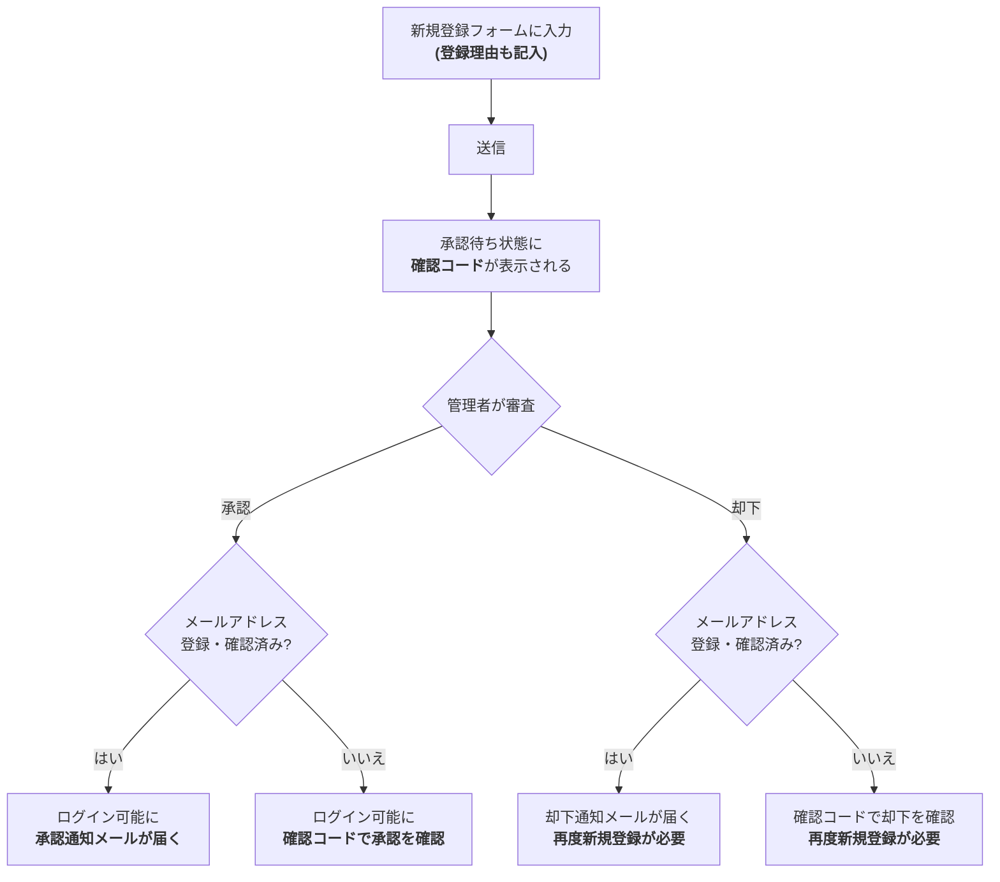

# 承認式新規登録

Juice Serverでは、新規登録の際に登録理由の入力を必須とし、管理者が内容を確認した上で承認する「承認式新規登録」を採用しています。**登録フォームを送信しただけでは、まだアカウントは使えません。**

## 登録から利用開始までの流れ



### 1. 新規登録フォームに入力する

通常の登録項目(ユーザー名・パスワード・メールアドレスなど)に加えて、「**登録理由**」の入力欄があります。どんな用途で使いたいかを簡単に書いてください(最大4096文字)。登録理由は一般ユーザーや他の申請者には公開されず、**管理者のみ**が確認します。

#### 登録理由のテンプレート

何を書けばいいか迷う場合は、以下のようなテンプレートを参考にしてください。全部埋める必要はなく、かしこまった文章でなくても構いません。

```
利用目的:
(例: 創作物の投稿、友人との交流、情報収集など)

投稿する予定の内容:
(例: イラスト、日常のつぶやき、ゲームの話など)

他のSNS等でのアカウント(任意):
(あれば、他のインスタンスやX(Twitter)などのIDを書いてもらえると審査の参考になります)
```

「イラストを投稿したいです」のような一言だけでも問題ありません。

### 2. 送信すると「承認待ち」になる

フォームを送信するとアカウント自体は作成されますが、**承認されるまではログインできません。** このとき画面に「登録審査状況の確認コード」が表示されます。**必ずこの場でコピーして控えておいてください**(詳しくは下記「審査状況をあとから確認する」を参照)。

### 3. 管理者が登録理由を確認する

管理者(モデレーターまたは管理者権限を持つユーザー)が登録理由を確認し、承認または却下します。審査にかかる時間はケースバイケースです。

### 4. 承認・却下の結果を受け取る

- **承認された場合**: ログインできるようになります。メールアドレスを登録・確認済みの場合は承認通知メールも届きますが、未登録の場合は届かないため、「確認コード」を使って`/signup-check`ページから承認状況を確認してください。
- **却下された場合**: メールアドレスを登録・確認済みの場合は却下通知メールが届きます。未登録の場合は同様に`/signup-check`ページで確認コードから却下されたことと理由を確認できます。もう一度申請したい場合は、新しいアカウントとして登録し直してください(却下された申請自体は再開できません)。

## 審査状況をあとから確認する

承認待ちの間はログインできないため、代わりに「登録審査状況の確認コード」を使って現在の状況(承認待ち・承認済み・却下)を確認できます。

- 確認コードは、登録完了時にコピーボタン付きのダイアログで表示されます。
- 確認コードはこの端末に自動保存され、いつでも**`/signup-check`ページ**(未ログイン時のトップページからも開けます)から一覧で確認できます。1台の端末から複数アカウント分申請した場合も、それぞれ個別に追跡できます。
- 端末を変えた場合などは、`/signup-check`ページで確認コードを手動で追加することもできます。

::: warning
確認コードは登録完了時にしか表示されません。**必ずその場でコピーし、忘れずに保管してください。**
:::

## このインスタンスが承認式を採用している理由

[このインスタンスの運用方針について](../about-juice-server.md)をご覧ください。
