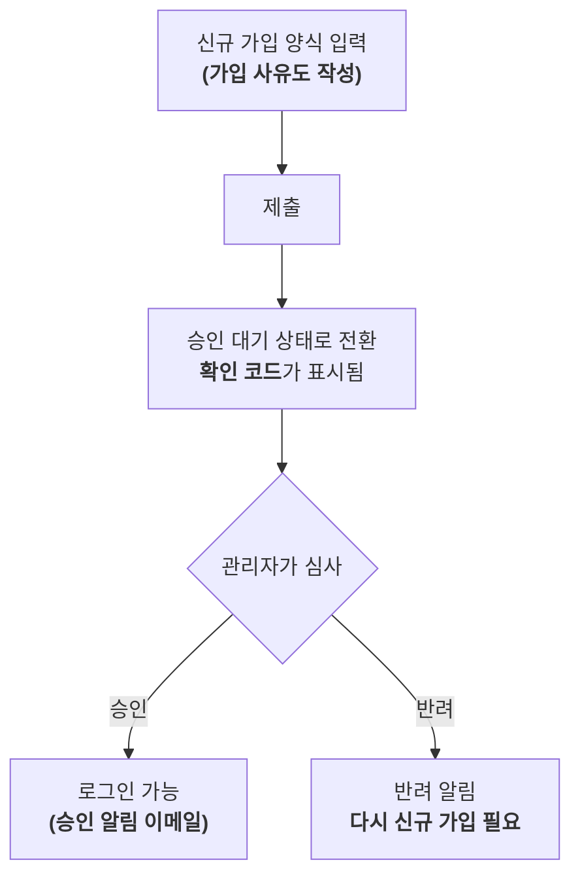

# 승인제 신규 가입

Juice Server에서는 신규 가입 시 가입 사유 입력을 필수로 하고, 관리자가 내용을 확인한 후 승인하는 "승인제 신규 가입"을 채택하고 있습니다. **가입 양식을 제출하는 것만으로는 아직 계정을 사용할 수 없습니다.**

## 가입부터 이용 시작까지의 흐름



### 1. 신규 가입 양식 입력하기

일반적인 가입 항목(사용자명・비밀번호・이메일 주소 등)에 더해, "**가입 사유**" 입력란이 있습니다. 어떤 용도로 사용하고 싶은지 간단히 작성해 주세요(최대 4096자). 가입 사유는 일반 사용자나 다른 신청자에게 공개되지 않으며, **관리자만** 확인할 수 있습니다.

#### 가입 사유 템플릿

무엇을 써야 할지 고민된다면 아래와 같은 템플릿을 참고해 주세요. 모든 항목을 채울 필요는 없고, 격식 있는 문장이 아니어도 괜찮습니다.

```
이용 목적:
(예: 창작물 게시, 친구와의 교류, 정보 수집 등)

게시할 예정인 콘텐츠:
(예: 일러스트, 일상 게시물, 게임 이야기 등)

다른 SNS・인스턴스 계정(선택 사항):
(있다면 X(트위터) 등의 ID를 적어주시면 심사에 참고가 됩니다)
```

"일러스트를 올리고 싶어요" 같은 한 줄 정도만 적어도 괜찮습니다.

### 2. 제출하면 "승인 대기" 상태가 됨

양식을 제출하면 계정 자체는 생성되지만, **승인될 때까지는 로그인할 수 없습니다.** 이때 화면에 "가입 심사 상태 확인 코드"가 표시됩니다. **반드시 이 자리에서 복사해 보관해 주세요**(자세한 내용은 아래 "나중에 심사 상태 확인하기" 참고).

### 3. 관리자가 가입 사유를 확인

관리자(모더레이터 또는 관리자 권한을 가진 사용자)가 가입 사유를 확인하고 승인 또는 반려합니다. 심사 소요 시간은 경우에 따라 다릅니다.

### 4. 승인・반려 결과 받기

- **승인된 경우**: 로그인할 수 있게 됩니다. 이메일 주소를 등록・인증한 경우 승인 알림 이메일도 발송됩니다.
- **반려된 경우**: 알림이 발송됩니다. 다시 신청하고 싶은 경우 새 계정으로 다시 가입해 주세요(반려된 신청 자체는 재개할 수 없습니다).

## 나중에 심사 상태 확인하기

승인 대기 중에는 로그인할 수 없기 때문에, 대신 "가입 심사 상태 확인 코드"를 사용해 현재 상태(승인 대기・승인됨・반려됨)를 확인할 수 있습니다.

- 확인 코드는 가입 완료 시 복사 버튼이 있는 대화상자로 표시됩니다.
- 확인 코드는 해당 기기에 자동으로 저장되며, 언제든지 **`/signup-check` 페이지**(로그아웃 상태의 첫 화면에서도 열 수 있습니다)에서 목록으로 확인할 수 있습니다. 한 기기에서 여러 계정을 신청한 경우에도 각각 개별적으로 추적할 수 있습니다.
- 기기를 변경한 경우 등에는 `/signup-check` 페이지에서 확인 코드를 수동으로 추가할 수도 있습니다.

::: warning 주의
확인 코드는 가입 완료 시에만 표시됩니다. **반드시 그 자리에서 복사하여 잊지 말고 보관해 주세요.**
:::

## 이 인스턴스가 승인제를 채택하고 있는 이유

[이 인스턴스의 운영 방침에 대해서](../about-juice-server.md)를 참고해 주세요.
