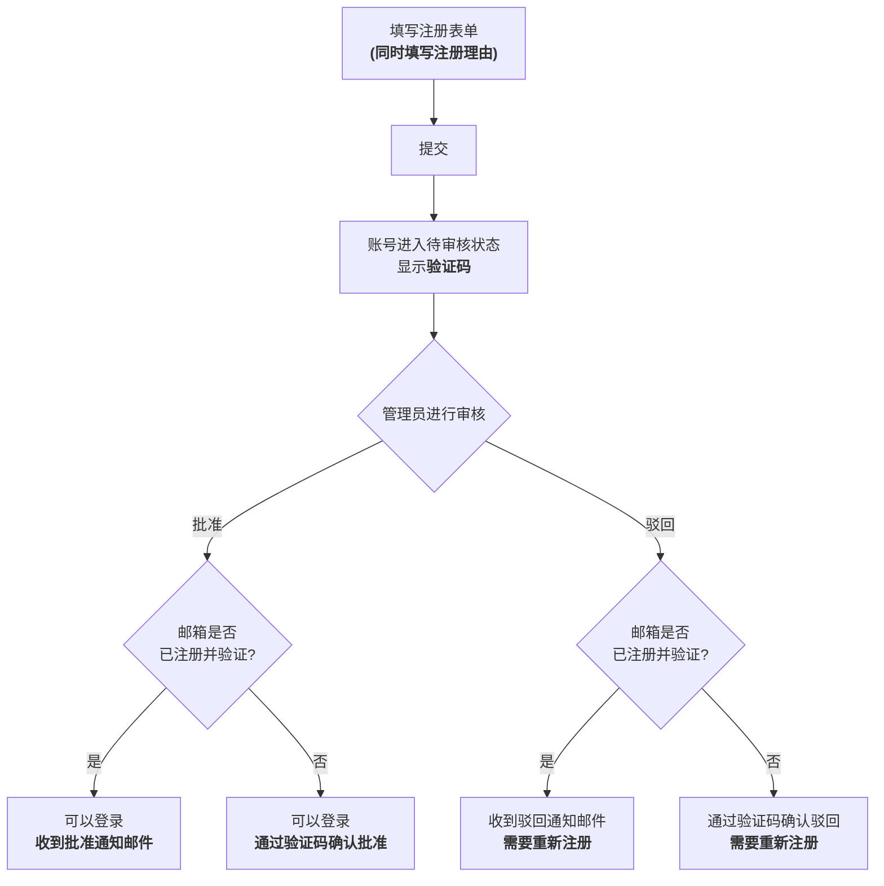

# 审核制注册

Juice Server 采用"审核制注册"机制,新用户注册时必须填写注册理由,并由管理员审核后方可批准。**仅提交注册表单并不能立即使用账号。**

## 从注册到可以登录的流程



### 1. 填写注册表单

除用户名・密码・电子邮箱地址等常规注册项目外,还有一个"**注册理由**"输入栏。请简要说明您希望使用本账号的用途(最多 4096 字)。注册理由不会公开给普通用户或其他申请者,**仅管理员**可以查看。

#### 注册理由模板

如果不知道该写什么,可以参考以下模板。不必每一项都填写,也不需要写得很正式。

```
使用目的:
(例如: 发布创作内容、与朋友交流、获取资讯等)

计划发布的内容:
(例如: 插画、日常动态、游戏相关话题等)

其他 SNS・实例账号(可选):
(如有,填写 X(Twitter)等账号有助于审核)
```

即使只写一句"想发布自己的插画"这样的话也没有问题。

### 2. 提交后进入"待审核"状态

提交表单后,账号本身会被创建,但**在获得批准之前无法登录。** 此时屏幕上会显示"注册审核状态验证码"。**请务必当场复制并妥善保存**(详情请参阅下方"稍后查询审核状态")。

### 3. 管理员审核注册理由

管理员(具有版主或管理员权限的用户)将审核您的注册理由,并作出批准或驳回的决定。审核所需时间因情况而异。

### 4. 接收批准・驳回结果

- **获得批准时**: 您将可以登录。若已注册并验证电子邮箱地址,还会收到批准通知邮件;若未注册,则不会收到邮件,请通过 `/signup-check` 页面使用验证码确认批准状态。
- **被驳回时**: 若已注册并验证电子邮箱地址,将收到驳回通知邮件。若未注册,同样可以在 `/signup-check` 页面通过验证码确认驳回结果及理由。若想再次申请,请以新账号重新注册(被驳回的申请本身无法恢复)。

## 稍后查询审核状态

由于待审核期间无法登录,您可以使用"注册审核状态验证码"来查询当前状态(待审核・已批准・已驳回)。

- 验证码会在注册完成时,通过带有复制按钮的对话框显示。
- 验证码会自动保存在您所使用的设备上,您可以随时通过**`/signup-check` 页面**(未登录状态下也可从首页进入)查看列表。即使从同一设备申请了多个账号,也可以分别单独追踪。
- 如更换设备等情况,也可以在 `/signup-check` 页面手动添加验证码。

::: warning 注意
验证码仅在注册完成时显示一次。**请务必当场复制并妥善保存,切勿遗忘。**
:::

## 本实例采用审核制的原因

请参阅[关于本实例的运营方针](../about-juice-server.md)。
