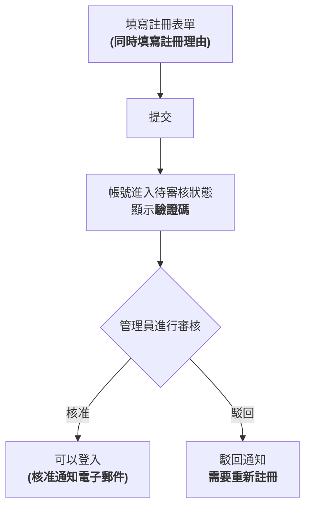

# 審核制註冊

Juice Server 採用「審核制註冊」機制,新使用者註冊時必須填寫註冊理由,並由管理員審核後方可核准。**僅提交註冊表單並不能立即使用帳號。**

## 從註冊到可以登入的流程

### 1. 填寫註冊表單

除使用者名稱・密碼・電子郵件地址等一般註冊項目外,還有一個「**註冊理由**」輸入欄。請簡要說明您希望使用本帳號的用途(最多 4096 字)。註冊理由不會公開給一般使用者或其他申請者,**僅管理員**可以查看。

### 2. 提交後進入「待審核」狀態

提交表單後,帳號本身會被建立,但**在取得核准之前無法登入。** 此時畫面上會顯示「註冊審核狀態驗證碼」。**請務必當場複製並妥善保存**(詳情請參閱下方「稍後查詢審核狀態」)。

### 3. 管理員審核註冊理由

管理員(具有版主或管理員權限的使用者)將審核您的註冊理由,並做出核准或駁回的決定。審核所需時間因情況而異。

### 4. 接收核准・駁回結果

- **取得核准時**: 您將可以登入。若已註冊並驗證電子郵件地址,還會收到核准通知電子郵件。
- **被駁回時**: 您將收到通知。若想再次申請,請以新帳號重新註冊(被駁回的申請本身無法恢復)。

## 稍後查詢審核狀態

由於待審核期間無法登入,您可以使用「註冊審核狀態驗證碼」來查詢目前狀態(待審核・已核准・已駁回)。

- 驗證碼會在註冊完成時,透過附有複製按鈕的對話方塊顯示。
- 驗證碼會自動儲存在您所使用的裝置上,您可以隨時透過**`/signup-check` 頁面**(未登入狀態下也可從首頁進入)查看清單。即使從同一裝置申請了多個帳號,也可以分別單獨追蹤。
- 如更換裝置等情況,也可以在 `/signup-check` 頁面手動新增驗證碼。

::: warning 注意
驗證碼僅在註冊完成時顯示一次。**請務必當場複製並妥善保存,切勿遺忘。**
:::

## 本實例採用審核制的原因

請參閱[關於本實例的營運方針](../about-juice-server.md)。
